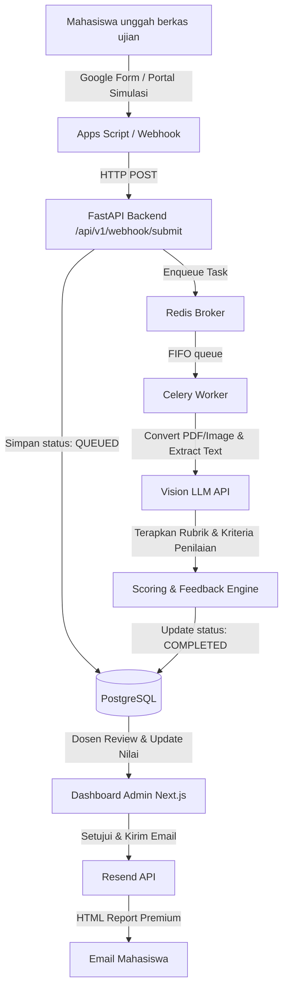

# AI Exam Assessment System (exam-ai)

> Platform pemeriksaan, transkripsi tulisan tangan (OCR), dan penilaian otomatis jawaban ujian essay berbasis Vision AI yang terintegrasi menggunakan Google Form / Portal Simulasi, FastAPI, Next.js 16 (Tailwind v4), dan Redis/Celery.

[](http://168.144.140.116:8080)
[](#tech-stack)

---

## 📖 Ringkasan Proyek

**AI Exam Assessment System** adalah solusi cerdas untuk otomatisasi koreksi lembar jawaban essay mahasiswa yang diunggah dalam format PDF atau gambar. Dengan menggabungkan teknologi **Multimodal Vision AI (GPT-4o-mini / Gemini 1.5 Flash)** untuk mengekstrak tulisan tangan secara akurat dan menilai konten secara objektif berdasarkan kriteria rubrik dinamis, sistem ini memangkas beban administratif koreksi dosen secara signifikan.

Sistem dirancang dengan arsitektur asinkron yang tangguh (*queue-based*) agar dapat berjalan stabil, responsif, dan hemat resource pada server berspesifikasi minimum (VPS RAM 4GB).

---

## 🛠️ Tech Stack & Arsitektur

### 💻 Frontend (Dashboard & Monitoring Portal)
* **Next.js 16.2.9** (App Router, React 19)
* **Tailwind CSS v4** (Desain modern, adaptif, dengan variabel HSL terintegrasi)
* **Material Symbols Outlined** (Ikon UI)
* **Cookie-based JWT Auth** (Manajemen sesi pengguna aman)
* **Next.js Middleware** (Server-side routing & protection rute di `/src/middleware.ts`)
* **Responsive Split-screen Layout** (Stacked view vertikal di mobile, adjustable panel split di desktop pada halaman Review)

### ⚙️ Backend (Core Engine & Workers)
* **FastAPI** (Python framework berkinerja tinggi, asynchronous)
* **Celery & Redis** (Antrean FIFO & processing asinkron terdistribusi)
* **PyMuPDF (fitz)** & **Requests** (Pemrosesan file PDF & unduhan berkas eksternal)
* **PostgreSQL** (Penyimpanan database relasional tangguh)
* **SQLAlchemy** (Python ORM)

### 🤖 AI & Integrasi Eksternal
* **Google Apps Script Webhook** (Integrasi instan dari pengiriman Google Form resmi)
* **GPT-4o-mini / Gemini 1.5 Flash** (Vision & Text Scoring API)
* **Resend API** (Otomatisasi pengiriman laporan hasil ujian berbentuk HTML premium ke email mahasiswa)

---

## 📂 Struktur Repositori (Monorepo)

```txt
exam-ai/
├── backend/            # FastAPI Backend & Celery Workers
│   ├── app/
│   │   ├── api/        # Endpoint API, Webhooks, & Authentication
│   │   ├── core/       # Konfigurasi, Keamanan, & Database
│   │   ├── models/     # Model Database (SQLAlchemy)
│   │   ├── schemas/    # Skema Validasi Pydantic
│   │   ├── services/   # Layanan Vision LLM & Email (Resend)
│   │   └── workers/    # Task Celery (Async Jobs)
│   ├── Dockerfile
│   └── requirements.txt
├── frontend/           # Next.js Dashboard UI
│   ├── src/
│   │   ├── app/        # Halaman Next.js (Dashboard, Portal Submit, Review, dll.)
│   │   ├── components/ # Header (Clean Header) & Sidebar (Mobile Navigation Drawer)
│   │   ├── context/    # AuthContext (Sesi & HTTP Interceptor)
│   │   └── middleware.ts # Proteksi Halaman Server-side
│   ├── Dockerfile
│   └── package.json
├── docker-compose.yml  # Orkestrasi Docker lokal/produksi
├── PRD.md              # Dokumen Kebutuhan Produk (Final)
└── README.md           # Panduan Dokumentasi (File Ini)
```

---

## 🔄 Alur Kerja Sistem (Workflow)



1. **Pengumpulan Berkas:** Mahasiswa mengirim lembar jawaban via Google Form resmi atau secara simulasi di `/submit` portal mahasiswa.
2. **Trigger Webhook:** Data dialirkan ke FastAPI backend `/api/v1/webhook/submit`, dicatat statusnya (`QUEUED`), dan didelegasikan ke antrean.
3. **Pemrosesan Asinkron (Celery + Redis):** Worker mengambil tugas, menggunakan `PyMuPDF` untuk memecah PDF, mengirim gambar ke Vision LLM untuk OCR (transkripsi tulisan tangan) & analisis kriteria nilai.
4. **Dashboard & Koreksi Manual:** Dosen masuk ke `/login` (terproteksi middleware server-side). Dosen dapat melihat antrean real-time, statistik dinamis (Total Mahasiswa, Ujian Aktif, Akurasi AI), mengedit rubrik soal dinamis, memicu hitung ulang AI, atau melakukan koreksi skor/umpan balik secara manual.
5. **Notifikasi Premium:** Setelah disetujui, sistem mengirim laporan HTML premium (mengandung bagan visual per soal, skor kelulusan, & feedback dosen) secara otomatis ke email mahasiswa.

---

## 🚀 Panduan Memulai Cepat (Local Setup)

### Prasyarat
* Docker & Docker Compose terinstal di komputer Anda.
* API Key Google Gemini atau OpenAI.
* API Key Resend.

### Langkah 1: Kloning Repositori
```bash
git clone https://github.com/adimhsd/exam-ai.git
cd exam-ai
```

### Langkah 2: Konfigurasi Environment Variables
Buat berkas `.env` di folder root dengan isi sebagai berikut:

```env
# Database Configuration
POSTGRES_USER=postgres
POSTGRES_PASSWORD=securepassword
POSTGRES_DB=exam_db
DATABASE_URL=postgresql://postgres:securepassword@db:5432/exam_db

# Redis
REDIS_URL=redis://redis:6379/0

# LLM APIs
OPENAI_API_KEY=your_openai_api_key
GEMINI_API_KEY=your_gemini_api_key

# Resend Email Service
RESEND_API_KEY=your_resend_api_key
EMAIL_FROM=Exam System <no-reply@exam.adi-muhamad.my.id>
```

### Langkah 3: Jalankan dengan Docker Compose
Jalankan perintah berikut untuk membangun dan menjalankan semua container:

```bash
docker compose up --build -d
```

Setelah semua container aktif:
* **Frontend Dashboard:** [http://localhost:8080](http://localhost:8080)
* **Backend API (Swagger Docs):** [http://localhost:8000/docs](http://localhost:8000/docs)
* **Portal Submit Mahasiswa:** [http://localhost:8080/submit](http://localhost:8080/submit)

---

## 📝 Konfigurasi Webhook Google Apps Script

Untuk mengalirkan data otomatis dari tanggapan Google Form ke backend FastAPI:

1. Buka Google Sheet tempat tanggapan Form disimpan.
2. Pilih menu **Extensions** > **Apps Script**.
3. Tempel kode berikut:

```javascript
function onSubmit(e) {
  var url = "http://168.144.140.116:8000/api/v1/webhook/submit"; // Sesuaikan URL API backend Anda
  
  var response = e.values;
  var payload = {
    "timestamp": response[0],
    "email": response[1],
    "nama": response[2],
    "nim": response[3],
    "file_url": response[4] // Pastikan kolom ke-5 berisi URL upload berkas PDF
  };
  
  var options = {
    "method": "post",
    "contentType": "application/json",
    "payload": JSON.stringify(payload)
  };
  
  UrlFetchApp.fetch(url, options);
}
```
4. Buat trigger di menu **Triggers (ikon jam)** > **Add Trigger** > Pilih `onSubmit` > Event Source: `From spreadsheet` > Event type: `On form submit` > Simpan dan berikan izin akses.

---

## 🧭 Roadmap Fitur & Status Implementasi

* **Fungsionalitas Utama (Selesai):**
  - [x] Antrean asinkron FIFO (Celery & Redis)
  - [x] Pipeline Vision LLM OCR (Transkripsi tulisan tangan lembar jawaban)
  - [x] Editor Rubrik Ujian Interaktif & Bank Soal dinamis (Dosen dapat mengedit, menambah, & menghapus soal/kriteria evaluasi AI)
  - [x] Form Pembuatan Ujian Baru Dinamis per Mata Kuliah
  - [x] Form Pembuatan Kelas/Mata Kuliah Baru
  - [x] Portal Pengiriman Simulasi Mahasiswa (`/submit`)
  - [x] Desain Ulang Template Email HTML Hasil Ujian Premium (dengan visual progress bars per soal & kelulusan otomatis)
  - [x] Keamanan server-side routing Next.js (`middleware.ts`)
  - [x] Dasbor Analitik Dinamis dari Database Postgres (penghitungan volume pengumpulan, log sistem gagal, akurasi rata-rata AI, jumlah mahasiswa aktif)
